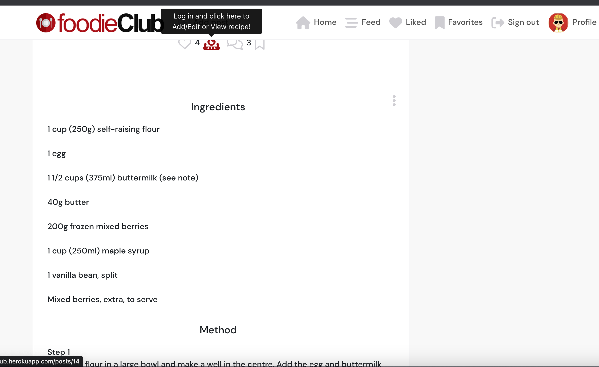

# foodieClub - Frontend

foodieClub project portfolio has been created for educational purposes only as the 5th project in the Code Institute’s full stack development program.

Using the principles of UX design and the agile development methodology, this project was developed using React that handles all the frontend functionality including user profiles, posts, comments, likes, bookmark posts, add recipes to posts, followers, authentication, authorization and more.

foodieClub is an application where users can create online posts about their favorite food, with functionalities to add recipes, like, leave comments, and bookmark favorite posts; while also being able to see different posts and recipes from other users. Through these functionalities, they will be able to engage with the App community.

Please note, this project is fairly similar to the walkthrough project Moments of Code Institute as I used that as baseline due the complextity of this new front-end library. I have tried to customize this project as much as possible within the timeline I had.

# Preview

You can view the live deployed backend here: <a href="https://foodieclub-drf-api.herokuapp.com/" target="_blank"> foodieClub DRF-API </a>

You can view the live site here: <a href="https://foodieclub.herokuapp.com/" target="_blank"> foodieClub App </a>

The repository for the backend application can be found here:  <a href="https://github.com/henryl74/foodieClub-drf-api" target="_blank"> foodieClub DRF-API </a>

# Contents

* [Agile Methodology](#agile-methodology)
* [User Stories](#user-stories)
* [Design](#design)
* [Features](#features)
* [Future Features](#future-features)
* [Technologies Used](#technologies-used)
* [Development](#development)
* [Testing](<#testing>)
  * [Bugs Fixed](./docs/testing.md#bugs-fixed)
* [Deployment](#deployment)
* [Credits](<#credits>)
* [Acknowledgements](<#acknowledgements>)

## Agile Methodology

The principles of agile methodology were utilized during the project. By assigning user stories to issues and taking advantage of the GitHub Kanban board functionality, the necessary goals and priorities throughout the project could be well defined. In addition, labels were used to further define the priority of each user story in the Kanban board.

[Back to top](<#contents>)

## User Stories

  -   #### First Time Visitor Goals

        - As a user I can view a NavBar from every page so that I can navigate easily between pages
        - As a user I can can navigate through pages quickly so that I can view content seamlessly without page refresh
        - As a user I can create a new account so that I can access all the features for signed up users
        - As a user I can sign in to the app so that I can access functionality for logged in users
        - As a user I can tell if I am logged in or not so that I can log in if I need to
        - As a user I can maintain my logged-in status until I choose to log out so that my user experience is not compromised
        - As a logged out user I can see sign in and sign up options so that I can sign in/sign up
        - As a user I can view user's avatars so that I can easily identify users of the application
        - As a logged in user I can create posts so that I can share my food recipes with everybody
        - As a user I can view the details of a single post so that I can learn more about it
        - As a logged in user I can like a post so that I can show my support for the posts that interest me
        - As a user I can view all the most recent posts, ordered by most recently created first so that I am up to date with the newest content
        - As a user I can search for posts with keywords, so that I can find the posts and user profiles I am most interested in
        - As a logged in user I can view the posts I liked so that I can find the posts I enjoy the most
        - As a logged in user I can view content filtered by users I follow so that I can keep up to date with what they are posting about
        - As a user I can keep scrolling through the images on the site, that are loaded for me automatically so that I don't have to click on "next page"
        - As a user I can view the posts page so that I can read the comments about the post
        - As a post owner I can edit my post title and description so that I can make corrections or update my post after it was created
        - As a logged in user I can add comments to a post so that I can share my thoughts about the post
        - As a user I can see how long ago a comment was made so that I know how old a comment is
        - As a user I can read comments on posts so that I can read what other users think about the posts
        - As an owner of a comment I can delete my comment so that I can control removal of my comment from the application
        - As an owner of a comment I can edit my comment so that I can fix or update my existing comment
        - As a logged in user I can bookmark a post so that I can have a section just for my favourites recipes
        - As a logged in user I can add a recipe to my post so that to encourage user engagement with post
        - As an owner of a recipe I can delete my recipe so that I can control removal of content from the application
        - As a owner of a recipe I can edit my recipe so that I can fix or update my existing recipe
        - As a user I can view other users profiles so that I can see their posts and learn more about them
        - As a user I can see a list of the most followed profiles so that I can see which profiles are popular
        - As a user I can view statistics about a specific user: bio, number of posts, follows and users followed so that I can learn more about them
        - As a logged in user I can follow and unfollow other users so that I can see and remove posts by specific users in my posts feed
        - As a user I can view all the posts by a specific user so that I can catch up on their latest posts, or decide I want to follow them
        - As a logged in user I can edit my profile so that I can change my profile picture and bio
        - As a logged in user I can update my username and password so that I can change my display name and keep my profile secure

[Back to top](<#contents>)

## Design

The theme for the project is intended to target people who love food - professional and nonprofessional. This is a social media platform where users can interact through their posts, exchange ideas for recipes, and meet new people through the user experience.
    
- Colors  
The main colours are overall white, black and red; it blends well with the App layout and content.
- Font  
The fonts in the theme are clear and modern and contribute perfectly to the overall look of the site.  
- Images  
The images and logo in the theme provide great content to the site; as the user navigates through the pages, it reassures them of what this application intends to do.

[Back to top](<#contents>)

## Features

My project consists of the following pages and sections:

- Navigation Bar
- Home or landing page.
- Sign in page.
- Sign up page.
- Profile page.
- Add Post page.
- Feed page.
- Liked page.
- Favorites page.
- Add Comments.
- Add Recipe.
- Search Bar.
- Sign out page.

### The Navigation Bar

- The navigation bar shows all the sections that the user can enter and provides a quick and easy means of navigating the site.
- The navigation bar is very responsive and user friendly, it has an additional hover effect to help the user with his selection.
- The App logo located on the the left hand corner of the navigation bar, helps the user to go back to the home page by clicking on it.

### Home or landing page

- The home section makes the first impression of the site to the visitor; it displays the current posts and comments, and the most followed users. 

### Sign in page

- Allows the user to log in if he/she has already registered to the site.

### Sign up page

- Allows the user to register to the site, so he/she can start interacting with the App community.

### Profile page

- Dedicated page for logged-in users so they can create their profile, and add images and bio to the App.

### Add Post page

- Dedicated page for logged-in users; in this section, they can upload their publications.

### Feed page

- Dedicated page for logged-in users; in this section, they can see all posts they have interacted with.

### Liked page

- Dedicated page for logged-in users; in this section, they can see all posts they have liked.

### Favorites page

- Dedicated page for logged-in users; in this section, they can see all posts they have saved.

### Add Comments

- Dedicated feature for logged-in users; in this section, they can leave comments for all posts.

### Add Recipe

- Dedicated feature for logged-in users; in this section, they can add recipes to their posts.

### Search Bar

- Dedicated feature for all users logged in or not. It facilitates effective posts/profile search results throughout the App. 

### Sign out page

- Dedicated page for logged-in users; in this tab, they can end their online session.

[Back to top](<#contents>)

## Future Features

Due to time constraints, the following features will be considered for future implementation on a separate project:

- Feedback tab
- Recipe videos

[Back to top](<#contents>)

* # Technologies Used

    * ## Languages

        * [JavaScript](https://www.javascript.com/)
        * [HTML5](https://en.wikipedia.org/wiki/HTML/)
        * [CSS3](https://en.wikipedia.org/wiki/CSS)

    * ## React Dependencies

        * [NPM](https://www.npmjs.com/package/node) 
          Package manager used to install dependencies.
        * [React Bootstrap](https://react-bootstrap.github.io/) 
          Was used to style the website, add responsiveness and interactivity.
        * [Axios](https://axios-http.com/docs/intro) 
          As the HTTP client for the app.
        * [JWT Decode](https://www.npmjs.com/package/jwt-decode) 
          To help decoding JWTs token which are Base64Url encoded.
        * [react-infinite-scroll-component](https://www.npmjs.com/package/react-infinite-scroll-component)
          A component to make the post load as an infinite scroll.
        * [react-router-dom](https://www.npmjs.com/package/react-router-dom) 
          Bindings for using React Router in web applications.
        * [ESLint](https://eslint.org/) 
          ESLint was used to evaluate all the React.js code.
        * [Prettier](https://prettier.io/docs/en/index.html) 
          Prettier was used to enforce a consistent code style across my entire work.

    * ## Frameworks - Libraries - Programs Used

        * [React](https://reactjs.org/) 
          Advanced front-end JavaScript library for building user interfaces
        * [Bootstrap](https://react-bootstrap.github.io/)  
          Popular CSS Framework for developing responsive and mobile-first websites
        * [Font Awesome](https://fontawesome.com/) 
          A font and icon toolkit based on CSS
        * [Google Fonts](https://www.django-rest-framework.org/) 
          A library of 1482 open source font families and APIs for convenient use via CSS
        * [ElephantSQL](https://www.elephantsql.com/) 
          ElephantSQL is a PostgreSQL database hosting service were the database for foodSNAP was created
        * [Git](https://git-scm.com/) 
          Git was used for version control by utilizing the Gitpod terminal to commit to Git and push to GitHub
        * [GitHub](https://github.com/) 
          GitHub is used to store the project's code after being pushed from Git
        * [Heroku](https://id.heroku.com) 
          Heroku was used to deploy the live project
        * [W3C - HTML](https://validator.w3.org/) 
          W3C- HTML was used to validate all the HTML code
        * [W3C - CSS](https://jigsaw.w3.org/css-validator/) 
          W3C - CSS was used to validate the CSS code
        * [Google Chrome Dev Tools](https://developer.chrome.com/docs/devtools/) 
          To check App responsiveness and debugging
        * [Figma](https://www.figma.com/) 
          To build the logo and icon for the project

    * ## Other Technologies

        * [Stackoverflow](https://stackoverflow.com/)
        * [Flowchart](https://lucid.app/documents#/documents?folder_id=home)
        * [Cloudinary](https://cloudinary.com/)
        * [Slack](https://slack.com/intl/en-gb/)

[Back to top](<#contents>)

* # Development

    * ## Custom Components

        * Asset.js was created to display a spinner when data is being fetched to notify the user that an action is being performed.
        * Avatar.js was created to display the users profile image throughout the app.
        * DropdownOptions was created to display options to the user in a responsive way, such as the option to either edit or delete a post.
        * NavBar.js was created to display the navigation menu and display different options to the user depending on authentication.
        * NotFound.js as created to display a message to the user if the content they are looking for does not exist.

    * ## Custom Context

        * CurrentUserContext.js was created to get the current users authentication state, check if the user needs to sign up and also to redirect the user to the signin page if not signed in.
        * ProfileDataContext.js was created to setProfileData, handleFollow, handleUnfollow of user profiles and access this data throughout the app.

[Back to top](<#contents>)

# Testing

I have included testing details in a separate document called [Testing.md](./docs/testing.md)

[Back to top](<#contents>)

## Deployment

This project was created on GitHub and edited in GitPod by carrying out the following:

* A new repository was created without a template
* Name you new repository as per your project name and select 'Create Repository'
* I opened the repository on GitHub then clicked the 'Gitpod' button to build the GitPod workspace which would allow me to build and edit the code used to make my app.
* Version control was used throughout the project using the following commands in the terminal using Bash
* git add . or git add "file name" - to stage the changes and get them ready for being committed to the local repo.
* git commit -m "Description of the update" - to save the change and commit the change to the local repo
* git push - to push all committed changes to the GitHub
* commit --amend - for changing the wording or spelling of the most recent commit
* git reset "commit hash"
* git config pill.rebase true > git pull > git push was used when I could not push my code due an error, this put changes to one side, pull the code from Github, and then reapply my changes on top.

## Deployment to Heroku

Some of the deployment steps below are specifically required for this project and may not be applicable to older versions, or different projects.

Before deploying to Heroku I created the Procfile with web: serve -s build

This project was deployed to Heroku using the following steps:

## Create your Heroku app

* Navigate to the Heroku website
* Create a Heroku account by entering your email address and a password (or login if you have one already).
* Activate the account through the authentication email sent to your email account
* Click the **new button** on the top right corner of the screen and select create a new app from the dropdown menu.
* Enter a unique name for the application.
* Select the appropriate region for the application.
* Click create app
* Navigate to the deployment tab of your new app, look for Deployment method' section select 'Github' and click the 'connect to Github' button to confirm.
* In the 'search' box enter the Github repository name for the project
* Click search and then click connect to link the heroku app with the Github backend repository. The box will confirm that heroku is connected to the repository.
* In 'manual deploy' section, click 'deploy branch'
* Once the build log is finished it will show open app button, click there to see deployed app.

### Forking the GitHub repo

If you want to make changes to the repo without affecting it, you can make a copy of it by 'Forking' it. This will make sure that the original repo remains unchanged.

<ol>
    <li>Log in to your GitHub account</li>
    <li>Navigate to the repository <a href="https://github.com/henryl74/foodieclub" target="_blank"><strong>here</strong></a></li>
    <li>Select the 'Fork' button in the top right corner of the page (under your account image)</li>
    <li>The repo has now been copied into your own repos and you can work on it in your chosen IDE</li>
    <li>If you have any suggestions to make regards to the code to make the site better, you can put in a pull request</li>
</ol>

### Cloning the repo with GitPod

<ol>
    <li>Log in to your GitHub account</li>
    <li>Navigate to the Repository <a href="https://github.com/henryl74/foodieclub" target="_blank"><strong>here</strong></a></li>
    <li>Select the 'Code' button above the file list on the right had side</li>
    <li>Ensure HTTPS is selected and click the clipboard on the right of the URL to copy it</li>
    <li>Open a new workspace in GitPod</li>
    <li>In the bash terminal type 'git clone [copy url here from step 4]'</li>
    <li>Press enter - the IDE will clone and download the repo</li>
</ol>

### Download and extract the zip directly from GitHub

<ol>
    <li>Log in to your GitHub account</li>
    <li>Navigate to the Repository <a href="https://github.com/henryl74/foodieclub" target="_blank"><strong>here</strong></a></li>
    <li>Select the 'Code' button above the file list on the right had side</li>
    <li>Select 'Download Zip'</li>
    <li>Once you have the Zip downloaded, open it with your prefered file decompression software</li>
    <li>You can then drag and drop the files from the folder into your chosen IDE or view/edit them on your local machine</li>
    <li>If you want to create a web-app from the repo please follow the instructions in "Project Deployment"</li>
</ol>

[Back to top](<#contents>)

## Credits

- [Code Institute walkthrough](https://codeinstitute.net/) as inspiration and code examples, the code institute walkthroughs "Moments" was referenced during the development cycle of this app.

- [JSX In Depth](https://legacy.reactjs.org/docs/jsx-in-depth.html)

- [React](https://react.dev/) The library for web and native user interfaces.

- [React Bootstrap](https://react-bootstrap.github.io/) the most popular front-end framework rebuilt for React.

- [React Testing Library](https://testing-library.com/docs/react-testing-library/intro/)

- [Stackoverflow](https://stackoverflow.com/)

- [Slack](https://slack.com/intl/en-gb/) community support.

- Code Institute - Tutor Assistance, **BIG THANK YOU** for all your support, suggestions and help!

[Back to top](<#contents>)

## Acknowledgements

- Again, the online tutors for all their help.
- The Code Institute slack community.
- All my classmates for constantly sharing new ideas in our dedicated slack channel.
- Stack Overflow question and answer website.
- My mentor for this project Marcel Mulders, thank you for your guidance and support given.
- My partner and my daughter, **THANK YOU** for all the support; and for being part of this journey.
- Code Institute student support team, for being there for us.
- **Thank you so much** for such a rewarding experience [Code Institute!](https://codeinstitute.net/)

[Back to top](<#contents>)