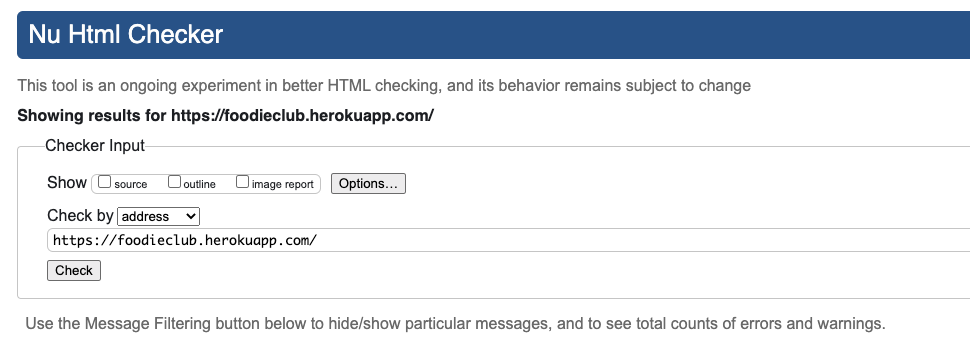
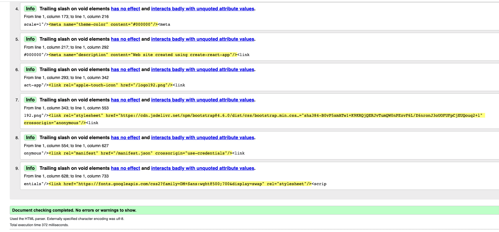
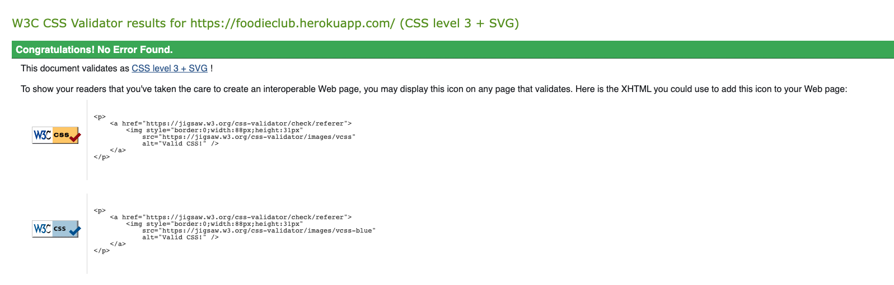
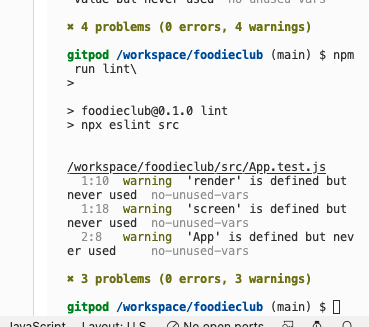

# Testing

## [Back to README.md](../README.md)

## Methodology  
Testing was done throughout the process while developing the project by using ***ESLint*** to evaluate all the React.js code. In addition I installed ***Prettier*** to enforce a consistent code style across my entire work.

All code has been also validated with different online tools as presented below.

* ## Html Code Validator

    * All the HTML pages code ran through [html code validator](https://validator.w3.org/#validate_by_uri) and there were no issues found.
  

* ## CSS Code Validator

    * All the CSS code ran through using [css code validator](https://validator.w3.org/#validate_by_input) and there were no issues found.

* ## ESLint Code Validator

    * I run [ESlint](https://eslint.org/) in my terminal and I had 3 warnings and 0 errors as a final score.

* ## Lighthouse Testing

    * Unfurtuanlety due to time constraints, and an issue with lighthouse I could not perform a test of my App using this tool. I've tried for two days to find out how to fix this and run my report there without any success.
    * I am sure that my application meets the required performance standards.  

* ## Bugs

    * All bugs were fixed throughout the development of this application, thanks to the errors displayed messages in the terminal and the use of ESlint and Prettier. 

### [**Bugs Fixed**](../README.md) 

* ## Manual Testing

    * In addition to the other tests, I have conducted a manual check list for myself to carry out to make sure that everything is working as intended.

| Status | **Navigation Bar Logged Out**
|:-------:|:--------|
| &check; | Clicking the navbar logo loads the home page
| &check; | That the navbar shows the tabs Home, Sign in, Sign up
| &check; | Clicking the Home tab on the navbar loads the home page
| &check; | Clicking the Sign in tab on the navbar loads the sign in page
| &check; | Clicking the Sign up tab on the navbar loads the sign up page

| Status | **Navigation Bar - User Logged In**
|:-------:|:--------|
| &check; | That the navbar shows the profile of the logged in user, sign out, favorites, liked, feed, home and Add post tabs.
| &check; | Clicking the navbar logo loads the home page
| &check; | That the navbar shows the tabs for Add post, Home, Feed, Liked, Favorites, Sign out and Profile.
| &check; | Clicking the Home tab on the navbar and loads the home page
| &check; | Clicking the Add post tab on the navbar and loads the add post page
| &check; | Clicking the Feed tab on the navbar and loads the feed page
| &check; | Clicking the Liked tab on the navbar and loads the liked posts page
| &check; | Clicking the Favorites tab on the navbar and loads the favorites posts page
| &check; | Clicking the Profile tab on the navbar loads the profile page
| &check; | Tested all functionalities for editing, changes, password update to a profile, add/edit/delete a post, like/unlike a post, save/unsave a post, add/edit/delete a recipe to a post, add/edit/delete comments from a post and search bar were exhaustively tested
| &check; | Clicking the Sign out tab on the navbar will end my online session

[Back to top](<#testing>)